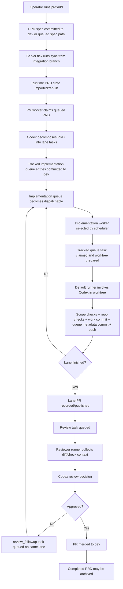

# Autonomy V2 Orchestrator Flow

This document describes how the package works as an orchestrator, not just as a CLI.

The short version is:

- `autonomy-v2-server` is a polling scheduler.
- `autonomy-v2-worker` is a single-agent execution wrapper.
- `src/server/orchestrator/index.js` is the deterministic control loop.
- Codex is used inside bounded points for planning, implementation, and review.
- Git, GitHub, runtime state files, leases, and worktrees are the deterministic guardrails around those AI calls.

## Module map

- `bin/autonomy-v2`
  Main operator CLI entrypoint. Delegates to `src/autonomy-v2.js`.
- `bin/autonomy-v2-server`
  Scheduler entrypoint. Delegates to `src/autonomy-v2-server.js`.
- `bin/autonomy-v2-worker`
  Worker entrypoint. Delegates to `src/autonomy-v2-worker.js`.
- `src/autonomy-v2.js`
  Command handlers for init, task/PR/review mutations, non-implementation lease handling, scope evaluation, status, and operator-facing state changes.
- `src/autonomy-v2-server.js`
  Long-running poll loop. Acquires the server lock and repeatedly calls one scheduler tick.
- `src/autonomy-v2-worker.js`
  Runs one worker cycle for one agent and finalizes runtime metadata.
- `src/server/orchestrator/index.js`
  Core scheduler. Loads config/runtime state, syncs PRD specs, decides which agents are due, spawns workers, and records execution state.
- `src/autonomy-v2/runner/default-runner.js`
  Default implementation/review runner. Wraps Codex with deterministic repo checks, git operations, PR updates, and error reporting.
- `src/autonomy-v2-codex.js`
  Codex integration. Uses structured output for planning/review and freeform execution for implementation.
- `src/autonomy-v2-dev-sync.js`
  Reconciles tracked PRD truth and tracked implementation queues on `dev` with local runtime state.
- `src/autonomy-v2-lock.js`
  Filesystem locks for server and state mutations.
- `src/config/index.js`
  Agent config validation.
- `src/autonomy-v2-github.js`
  GitHub token resolution.
- `templates/prompts/autonomous/v2/`
  Scaffolded workspace contract and operator-facing documentation for the consumer repo.

## Mental model

Autonomy v2 splits the system into two layers.

Tracked truth:

- `prompts/autonomous/v2/config/agents.json`
- `prompts/autonomous/v2/config/sprint.json`
- `prompts/autonomous/v2/queues/*.json`
- `prompts/autonomous/v2/specs/prds/*.json`
- `prompts/autonomous/v2/specs/prds/queue/*.json`
- `prompts/autonomous/v2/specs/prds/archived/*.json`
- `prompts/autonomous/v2/specs/prd-state/*.json`

Local runtime cache:

- `.autonomy/runtime/state/branch-locks.json`
- `.autonomy/runtime/state/leases.json`
- `.autonomy/runtime/state/prs.json`
- `.autonomy/runtime/state/runtime.json`
- `.autonomy/runtime/state/spec-sync.json`
- `.autonomy/runtime/agents/*`
- `.autonomy/worktrees/*`
- `.autonomy/control/dev-sync`

The scheduler rebuilds runtime state from tracked truth and external systems. The runtime files are operational state, not the long-term source of truth.
For implementation and reviewer work, tracked queue files are authoritative and runtime queue cache files are not.

## Deterministic vs nondeterministic boundary

Deterministic parts:

- config loading and validation
- lock acquisition
- tracked implementation queue mutation
- tracked reviewer queue mutation
- lease mutation for local runtime coordination
- PRD sync from `dev`
- worktree and branch preparation
- git add/commit/push/merge calls
- diff collection and scope evaluation
- required check execution
- PR/review state transitions and tracked implementation task transitions
- runtime log and error-report writing

Nondeterministic parts:

- PM task decomposition through Codex
- implementation edits through Codex
- review judgment and summary through Codex

The design intent is to keep the AI inside a deterministic wrapper:

- Codex planning must return schema-valid JSON.
- planned tasks are validated against implementation lanes and agent scope.
- implementation edits are judged by diff, scope, checks, and git side effects rather than required structured output.
- review output is combined with deterministic diff, scope, and check results before merge decisions are applied.

## End-to-end flow

## Scheduler loop

The steady-state operator workflow is:

1. Start `autonomy-v2-server serve`.
2. Add a PRD with `autonomy-v2 prd:add`.

Each server poll does this:

1. `src/autonomy-v2-server.js` acquires the server lock.
2. `runTick()` calls `runSchedulerTick(rootDir, ...)`.
3. `runSchedulerTick()` optionally syncs PRD specs from the integration branch through `src/autonomy-v2-dev-sync.js`.
4. The scheduler acquires the state lock and loads:
   - config
   - sprint
   - task queues
   - leases
   - PRDs
   - runtime worker state
5. It refreshes runtime state:
   - clears dead workers
   - reconciles stranded worker/runtime entries
   - updates aggregated runtime state files
6. It decides which agents are due:
   - PM if there is a queued PRD and no active planning PRD
   - implementation if there is dispatchable queue work
   - review if there is queued review work
7. It starts at most one worker process per due agent.
8. It writes the updated runtime snapshot.

Important constraint:

- the scheduler is polling, not event-driven
- one worker is active per agent id
- workers communicate completion by writing tracked queue state and runtime PR/review state, not by holding in-memory objects in the server

## Worker lifecycle

`src/autonomy-v2-worker.js` is intentionally small.

It does four things:

1. parses `run --agent <id>`
2. calls `runWorkerOnce(rootDir, agentId)`
3. emits worker log events when streaming is enabled
4. marks the worker idle in runtime state in a `finally` block

`runWorkerOnce()` in `src/server/orchestrator/index.js` dispatches by agent role:

- `pm` -> `runPmWorker()`
- `implementation` -> `runImplementationWorker()`
- `review` -> `runReviewerWorker()`

## PM flow

PM is the planning bridge between tracked PRD input and tracked implementation queues.

Sequence:

1. claim the next queued PRD from runtime state
2. call `planPrdTasksWithCodex(...)`
3. validate returned task specs against implementation agents and scopes
4. commit PRD metadata back to the integration branch
5. write planned implementation tasks into tracked per-agent queue files on `dev`
6. mark the PRD `planned`

What is important here:

- PM output is AI-generated, but it is constrained to JSON
- PM cannot create reviewer tasks directly
- PM persists queueable implementation work into tracked git state, not just runtime state

## Implementation flow

Implementation is a deterministic wrapper around a Codex edit session.

In `runImplementationWorker()`:

1. resolve the current tracked implementation queue for the agent
2. select one dispatchable task
3. if needed, claim the next queued task on `dev`
4. prepare the task worktree and deterministic lane branch
5. execute the fixed packaged default runner in the worktree

In the default runner:

1. read task, lane, PR, and completion context
2. call Codex in the prepared worktree
3. do not require structured implementation JSON
4. list changed files
5. evaluate path scope
6. run deterministic repo checks
7. commit the task result
8. record that work commit SHA into the tracked queue
9. push the lane branch
10. record or update the lane PR if the lane is complete

Important implementation invariants:

- one deterministic lane branch per lane
- one worktree per active lane
- one tracked queue file per implementation agent
- one PR per lane, not one PR per task
- implementation progress comes from tracked queue state, not raw branch commit count

## Review flow

Review is also a deterministic wrapper around Codex, but read-only.

In `runReviewerWorker()`:

1. claim one queued review task
2. invoke the fixed packaged default runner

In the default runner:

1. reconstruct review context and lane PR metadata
2. compute the diff against the base branch
3. run deterministic repo checks
4. evaluate deterministic scope on the diff
5. call Codex for the review decision
6. normalize the final decision using deterministic checks:
   - failing checks block
   - scope violations block
   - Codex concerns are advisory unless they map to the final decision
7. record the review
8. merge the PR if approved
9. if changes are requested, queue a `review_followup` task on the same lane

This means the AI does not have final authority over merge safety. The wrapper combines AI output with deterministic repo facts before mutating state.

## PRD sync flow

`src/autonomy-v2-dev-sync.js` is the bridge between tracked git state and runtime state.

Its job is to:

- fetch the integration branch
- inspect active PRD spec files on that branch
- ignore queued and archived PRD spec paths when importing active specs
- parse and validate PRD specs
- rebuild runtime PRD/task/PR state from:
  - the fetched integration branch
  - remote lane branches
  - GitHub PR state

This is one of the most important architectural points in the repo:

- implementation and reviewer execution advance through tracked queue files in git
- PM queue state remains operational local state resolved from its configured `taskQueue`
- committed PRD specs on `dev` are the durable planning contract
- tracked PRD lifecycle state lives in `prompts/autonomous/v2/specs/prd-state/*.json`
- restart/recovery is based on reconstructing from git and GitHub, not trusting stale runtime files blindly

## State machine summary

Common runtime objects:

- PRDs
- implementation tasks
- review tasks
- leases
- pull request records
- worker runtime entries

Implementation task shape, conceptually:

- `queued`
- `active`
- `done`
- `changes_requested`
- `conflicted`
- `failed`
- marked `done` in the tracked queue file and committed on the lane branch
- later represented through PR/branch-lock state after completion/merge

Review task shape, conceptually:

- `queued`
- `assigned`
- `changes_requested`
- `approved`
- `merged`
- `failed`

Worker runtime shape:

- `running`
- `idle`
- `pid`
- `lastResult`
- `lastError`

## Reliability model

The package assumes the unsafe parts are outside the core state machine:

- Codex may return poor plans, bad edits, or weak reviews
- git commands may fail
- GitHub API calls may fail
- worker processes may exit unexpectedly

The package tries to compensate by enforcing deterministic boundaries:

- locks around state mutation
- schema validation for structured AI output
- scoped file ownership
- explicit leases
- explicit worktree preparation
- required checks before commit/review
- runtime recovery on restart

Current practical fragility points:

- polling means repeated fatal errors can become repeated retries if not classified correctly
- runner failures need clear terminal vs retryable semantics
- sync is dependent on git/GitHub availability and consistency
- state is spread across git, runtime JSON, worktrees, and GitHub, so reconciliation quality matters more than any single file write

## Why the system feels both deterministic and nondeterministic

That tension is real and it is the central design property of this repo.

The deterministic layer decides:

- when an agent may run
- what task it is allowed to touch
- which files are in scope
- which checks must pass
- when a PR may be published
- when a PR may be merged

The nondeterministic layer decides:

- how to decompose a PRD
- how to implement the code within scope
- how to summarize review concerns

So the orchestrator is best understood as a state machine that repeatedly calls an AI inside constrained, auditable envelopes.

## Practical operator commands

Core commands in the package:

- `autonomy-v2 init`
- `autonomy-v2 prd:add`
- `autonomy-v2 status`
- `autonomy-v2 lease`
- `autonomy-v2 pr:record`
- `autonomy-v2 review:record`
- `autonomy-v2 prd:archive-completed`
- `autonomy-v2-server serve`
- `autonomy-v2-server tick`
- `autonomy-v2-worker run --agent <id>`

## Reading order for future contributors

If you need to understand the repo quickly, read in this order:

1. `README.md`
2. `templates/prompts/autonomous/v2/README.md`
3. `src/autonomy-v2-server.js`
4. `src/server/orchestrator/index.js`
5. `src/autonomy-v2-worker.js`
6. `src/autonomy-v2/runner/default-runner.js`
7. `src/autonomy-v2-codex.js`
8. `src/autonomy-v2-dev-sync.js`
9. `src/autonomy-v2.js`

That sequence mirrors the actual control flow from scheduler tick down to repo mutation.
